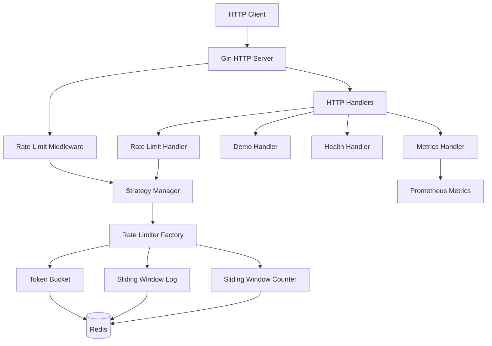
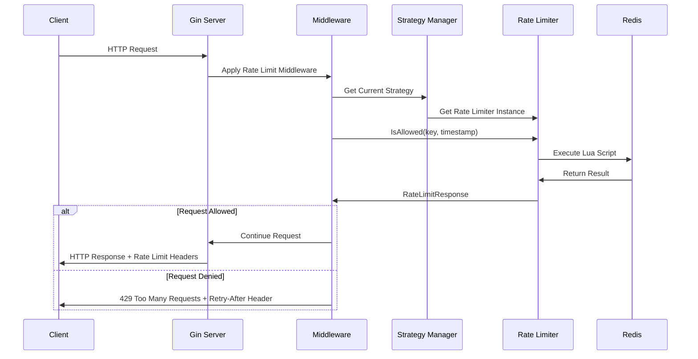
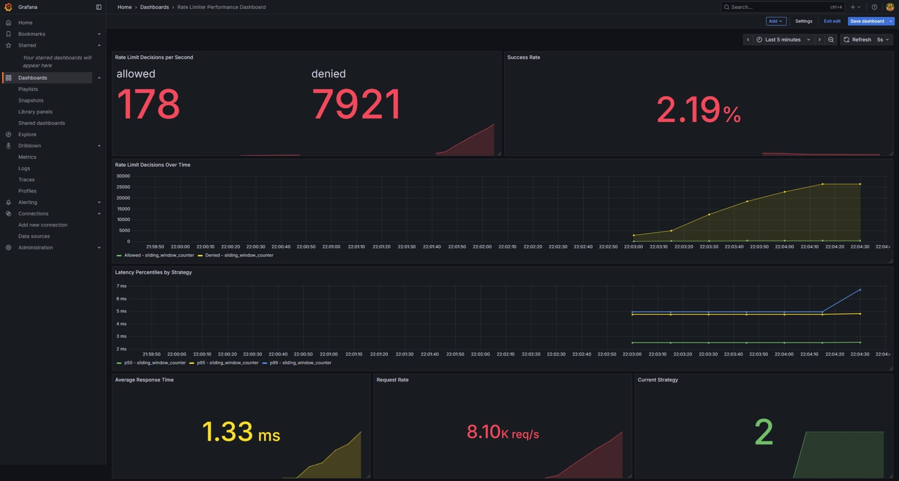

# go-rate-limiter

A Go-based rate limiter service with Redis backend supporting multiple rate limiting strategies.

## Table of Contents

- [Features](#features)
- [Quick Start with Docker](#quick-start-with-docker)
- [Rate Limiting Strategies](#rate-limiting-strategies)
- [API Endpoints](#api-endpoints)
- [Configuration](#configuration)
- [Architecture](#architecture)
- [Observability](#observability)
- [Self Notes](#self-notes)

## Features

- **Three Rate Limiting Strategies**: Token Bucket, Sliding Window Log, and Sliding Window Counter
- **Redis Backend**: Atomic operations using Lua scripts
- **HTTP API**: RESTful endpoints for rate limiting operations
- **Prometheus Metrics**: Built-in observability
- **Docker Support**: Easy deployment with Docker Compose
- **Configurable**: Environment variables and YAML configuration

## Quick Start with Docker

The easiest way to get the service running locally is with Docker Compose:

```bash
docker-compose up --build
```

This will start the rate limiter service on port 8080 and Redis. You can then test the service:

```bash
curl -X GET http://localhost:8080/health
```

## Rate Limiting Strategies

### Token Bucket

Think of it like a bucket that starts full of tokens. Each request takes a token, and tokens refill over time at a steady rate.

**Good for**: Allowing bursts of traffic while maintaining an average rate  
**Memory**: Very low (just stores token count and last refill time)

```
Bucket: [🪙🪙🪙🪙🪙] (5 tokens, refills 1/sec)
Request comes in → [🪙🪙🪙🪙 ] (4 tokens left)
1 second later  → [🪙🪙🪙🪙🪙] (back to 5 tokens)
```

### Sliding Window Log

Keeps track of every single request timestamp. Counts how many requests happened in the last X minutes.

**Good for**: When you need exact request counting  
**Memory**: High (stores every request timestamp)

```
Window: Last 60 seconds
Stored requests: [10:01:15, 10:01:30, 10:01:45, 10:02:00]
New request at 10:02:10 → Count all requests since 10:01:10
```

### Sliding Window Counter

Uses two time buckets - current and previous. Estimates the sliding window by blending the two based on how far you are into the current window.

**Good for**: Best balance of accuracy and efficiency  
**Memory**: Low (just two counters)

```
Previous hour: 80 requests  |  Current hour: 30 requests
If we're 30 minutes into current hour:
Effective count = 30 + (80 × 0.5) = 70 requests
```

## API Endpoints

- `POST /rate-limit` - Check if request is allowed
- `POST /rate-limit/reset` - Reset rate limit for a key  
- `GET /health` - Health check endpoint
- `GET /metrics` - Prometheus metrics
- `GET /api/restricted` - Demo endpoint with rate limiting
- `GET /api/unrestricted` - Demo endpoint without rate limiting


## Configuration

The service can be configured using environment variables with `GO_` prefix or a `config.yaml` file:

```yaml
server:
  port: ":8080"

redis:
  host: "localhost"
  port: 6379
  password: ""
  db: 0

rate_limiter:
  strategy: "sliding_window_counter"
  bucket_size: 100
  window_size_seconds: 60
```

## Architecture

### System Overview



### Request Flow



## Observability

### Prometheus Metrics

The service exposes Prometheus metrics at `/metrics` endpoint including:

- **Rate limiter performance**: Request counts, response times, error rates
- **Strategy-specific metrics**: Token bucket refills, window calculations
- **Redis operations**: Script execution times, connection stats
- **HTTP metrics**: Request duration, status codes, endpoint usage

### Grafana Dashboard

A pre-configured Grafana dashboard is available for monitoring:

- Real-time rate limiting decisions (allowed vs denied)
- Performance metrics by strategy type
- Redis connection and operation health
- Request patterns and traffic analysis



Access Grafana at `http://localhost:3000` when running with Docker Compose.

### Health Checks

- `GET /health` - Basic service health check
- Redis connectivity validation
- Strategy manager status

## Self Notes

### TTL Buffer

Adding a TTL Buffer to expiration in redis protects the logic from clock drift, network latency. Also adds a safety margin.

### Gotchas

Go redis client converts float values to int before returning from lua script. So if you want to return a float from lua script, do a `tostring(value)` before returning. Learnt this the hard way.

### IETF RateLimit Headers

IETF defines standard rate-limiting response headers to help clients understand rate limits:

* `RateLimit-Limit`: Max requests allowed in the window
* `RateLimit-Remaining`: Requests left in the current window
* `RateLimit-Reset`: Seconds until the window resets (or a timestamp)

Optional:

* `RateLimit-Policy`: Human-readable rate limit policy (e.g. `100;w=60` → 100 reqs per 60s)
